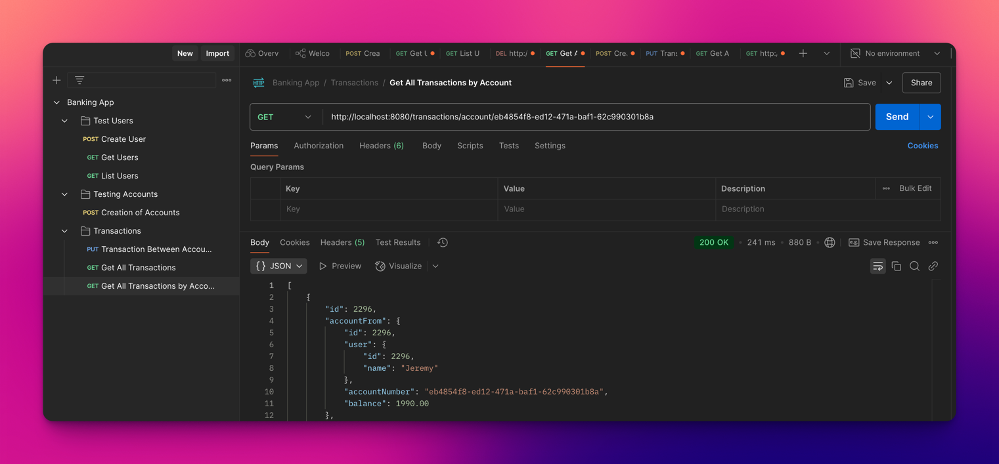

# Banking Project Application

---
A Banking Project Application made with the Java SpringBoot Framework.
___
## Features:
- User Creation, Updating, Listing, and Deletion
- Account Creation (opening), Updating, Listing, and Deletion (closing)
    - Account Linking to a Single User (Many to One Unidirectional)
    - Logging of account opening (creation), as well as closing (deletion) in the Transactions database
- Transaction Logging and Listing
    - Transactions containing the following data:
        - Account To (Linked, Many to One Unidirectional)
        - Account From (Linked, Many to One Unidirectional)
        - User Linked to (Many to One Unidirectional)
        - Amount
        - Transaction types (opening, closing, transfer, withdrawal, deposit)
    - Each time a transaction has been made, it is logged
    - Get transactions by User, Account to and Account From, as well as by Account.
- Error Messages that return specific errors
- Input Verification (See assumptions Section)
    - Insufficient Funds
    - Invalid Balance or Amount
    - Invalid IDs
- Test Suite
- PostgresQL Integration (can be in-memory in needed)
- Dependency Injection in Service and Repository Layers
- Three Layer Design
- Use of Mappers to Map DTOs to Entities. Entities are used in the services, controllers and repositories.
- Robust Design and Extensibility, and Maintainability.
---
## How to run:
1. Go to https://www.azul.com/downloads/?package=jdk#zulu to download OpenJDK, and download JDK 17 for your system
2. Download the code from this GitHub with your method of choice (The simplest way is like so):

3. Save into a location of your choice.

4. If you use IntelliJ IDEA (the Community Edition will suffice for this), Click "Open Project" and make sure to select the `pom.xml` file to load all dependencies correctly.

5. Make sure to have the right JDK Selected when using intelliJ

6. I have used Maven to for dependency management, and have two options for the `application.properties` file:
   1. Use an in-memory database to store data
   2. Use a PostgresQL instance to store data

7. In this example, we will use the in-memory database since it doesn't need any set up for the end user.
8. Open the Terminal in intelliJ

9. Run the following commands in this exact order to compile it yourself:
   1. `./mvnw clean test`  (OPTIONAL)
      1. If this does not say `Build Success` on your computer, then you have not configured the application properly. Repeat steps 4-7 again, (or 1-7 if you deem it necessary).
      2. This is to simply check if you have set up your environment correctly. It runs the unit tests to check for this. It is not required, since the next test will check as well.
   2. `./mvnw clean package -Dmaven.test.skip`
      1. This will create a `.jar` file in your `target` folder
   3. `cd target`
      1. This will make the terminal's working folder the `target` folder
   4. `java -jar Banking-project-0.0.1-SNAPSHOT.jar`
      1. This will run the compiled jar file.
10. Download and install Postman from https://www.postman.com/downloads/.
11. I have set up some tests of the main functionality of the application in the `Banking App.postman_collection.json` file
12. Once imported, these are the tests you will see:

13. If you run Create User, and have an empty database with the following request body in JSON from:

14. You will get the following response:

15. If you run this request again, you will get an error saying that you cannot make a user with the same name (See Assumptions for Details):

16. You can get a user by an ID (This is using the ID returned from the user that you previously created):

17. If user is not found, a 404 response is given, as well as a descriptive error message:

18. List Users will list users. It will return an empty response if incorrect, but an OK message since it is up to the frontend to display any errors here.

19. Creating an account will do the following:

20. In the case of an invalid account given, the following will occur:

21. You can provide a unique name for the user, no id and a valid balance, and a new account linked to the user with the same name will be created (see assumptions for why):

(ID is different because I switched to Postgres for the next demonstration)

22. When opening an account, it will get logged in the transaction database as an opening. It will include account to, account from and the amount (opening initial balance), as well as Ids that reference the correct user (see assumptions) and the correct accounts as well:

23. Now, if you have 2 accounts created, you can create a transaction between them:

24. If it is the same account, and is a transfer (as indicated by the url), it will not be considered valid:

25. You can also get all transactions:

26. You can get transactions by account as well:

27. Here it is in a much easier to read format:

28. There is far more to do here. If you wish to test further, use the endpoints defined in `src/main/com.achawathe.Banking.project/controllers` to make your own requests and test endpoints!
---
## Assumptions and Requirements
General Assumptions:
- Listing a table that is empty will return ok since this is up to the front end to handle.

Users:
- Each user has a unique name that is not empty.
- Each user has a unique ID, and systematically generated.

Accounts:
- Each account created will be unique (i.e. It will have a unique ID, systematically Generated UUID).
- Each account MUST be linked to a user.
- If a user exists with the same name for a given account in the user object, and no ID is given, the account will be linked to that user.
- The balance of a given account must not be negative, and cannot be null.
- Upon the creation of an account, it is classified as an opening.
- Upon deletion of account, it is classified as closing.
- The above two items will get logged as a transaction with the appropriate enum to denote the action taking place in the transactions database.

Transactions:
- Each transaction made is unique
- A transfer between accounts cannot contain the two of the same accounts.
- A transfer between accounts must be between accounts with the same user.
- There is deposit and withdrawal functionality.
- User account creation is not a transaction.
- Withdrawals and transfers need to check for amount <= account balance, and every transaction must be > 0.
- Any transaction must have a valid account to and account from, as well as a valid amount.